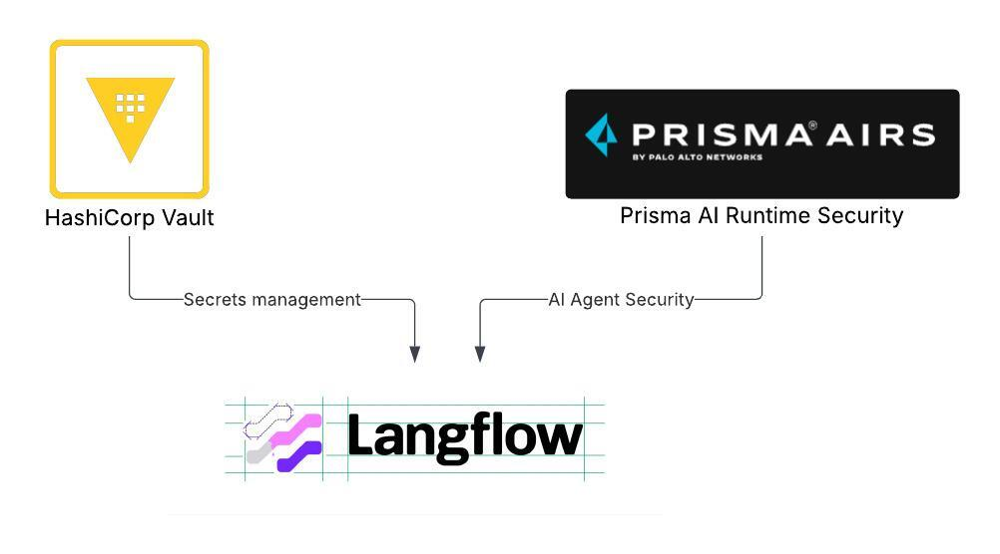
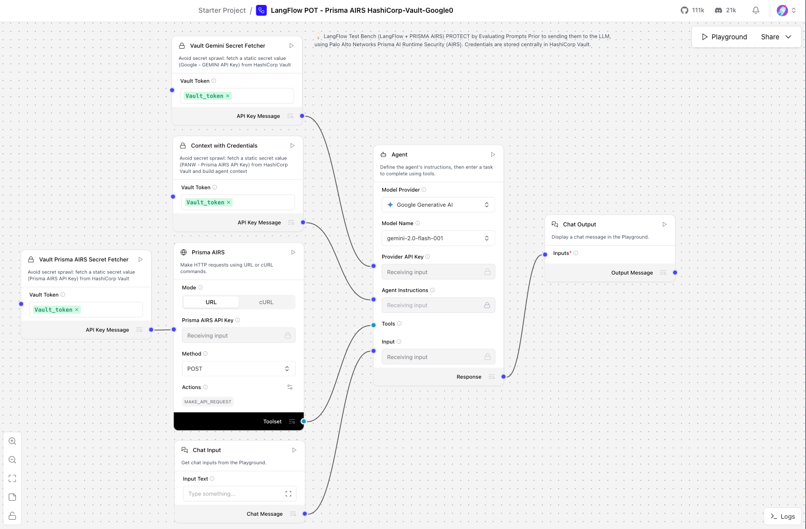

# Secure AI Agent Flow with Langflow, HashiCorp Vault, and Prisma AIRS

This project demonstrates the powerful **synergy between three enterprise-grade tools**:

- **Datastax Langflow (IBM)** – A visual programming interface for building and orchestrating AI agents and workflows.
- **HashiCorp Vault (IBM)** – A centralized secrets management system to secure sensitive data like API keys and credentials.
- **Palo Alto Networks Prisma AIRS** – An AI security and compliance layer that **scans all model inputs and outputs** for harmful or non-compliant content (like malicious URLs).



## Agent Flow in Langflow

- Agent receives input from a user.

- Input is scanned by Prisma AIRS via API.

- Langflow routes the sanitized input to Gemini (or any other LLM).

- The output from Gemini is again scanned by Prisma AIRS.

- Final response is delivered to the user only if safe.

- All calls to Prisma and LLMs are authenticated securely via secrets retrieved from HashiCorp Vault.



---

## Why This Matters

Building AI-powered applications requires more than just functional logic. Security and governance must be built into the foundation. This project offers:

- **AI agents with embedded guardrails** – Prisma AIRS ensures all prompts and outputs are safe and policy-compliant.
- **No secret sprawl** – All API keys and credentials are securely fetched from Vault at runtime.
- **Flexibility** – The project uses the **Gemini LLM** by default, but is easily configurable to use any language model backend.

---

## Prerequisites

- Langflow Desktop - install from source.

- HashiCorp Vault – for local development. Use HCP Vault Dedicated ot Vault Enterprise for production environments.

- Prisma AIRS API access + key (from Palo Alto Networks).

- Google Gemini access + key (default model used in the flow is gemini-2.0-flash-001).

    > **Note:**  No Gemini API key? Use another model and update the Agent component as needed (model provider, model name).

## How to run the flow

### Setting up Prisma AIRS

To use the Prisma AIRS (API Intercept Solution), you’ll need the following:

- A valid Prisma AIRS API token

- A configured deployment profile

Once your deployment profile is set up, update its name in two places within the flow:

1. Context with Credentials component

- Open the code > Update profile_name on line 72.

2. Prisma AIRS component

Open the code > Update profile_name on line 377.

For detailed setup instructions, refer to the [official PANW Prisma AIRS documentation](https://docs.paloaltonetworks.com/ai-runtime-security/activation-and-onboarding/activate-your-ai-runtime-security-license/create-an-ai-instance-deployment-profile-in-csp).

> **Note:**  If you don’t have access to Prisma AIRS, you can still test the agent using the Vault component. To do this, remove the connecting lines to the following components: "Context with Credentials", "Vault Prisma AIRS Secret Fetcher", "Prisma AIRS". Once these connections are removed, Langflow will ignore those components during execution.

### Setting up Vault locally

> **Note:** This POC uses Vault Community Edition for hands-on learning; for production, use [Vault Enterprise or HCP Vault Dedicated](https://www.hashicorp.com/en/products/vault) for enhanced scalability, disaster recovery, fine-grained access control, and a suite of other enterprise-grade features essential for secure and reliable production environments.

Install HashiCorp Vault (macOS):

```bash
brew tap hashicorp/tap
brew install hashicorp/tap/vault
```

Duplicate the setup script:

```bash
cp vault_setup.sh vault_setup_local.sh
```
Edit the new file and paste your actual Prisma AIRS API key and Gemini API key into the placeholders.

Run the script:
```bash
chmod +x vault_setup_local.sh
./vault_setup_local.sh
```
Vault will start and output a log including the **root token**. Copy this value - you’ll need it for Langflow.

To check if one of your secrets has been successfully stored in Vault, you can run:
```bash
 curl \
  --header "X-Vault-Token: <paste root token>" \
  http://127.0.0.1:8200/v1/secret/data/langflow
```

### Running Langflow

To add dependencies to Langflow Desktop, add an entry for the package to the application's requirements.txt file:

On macOS, the file is located at `/Users/USER/.langflow/data/requirements.txt`.

Add `hvac==2.3.0` to the file and hit "Save".

To securely access secrets from Vault inside Langflow:

- Launch Langflow Desktop.

- Import the JSON flow stored in this repo: `LangFlow POT - Prisma AIRS HashiCorp-Vault-Google0.json`.

- Click your profile circle (top-right corner). Go to Settings > Global Variables.

- Find the variable named `Vault_token`. If it doesn't exist, add it.

- Paste the Vault root token from the `./vault_setup_local.sh` script output into the Value field.

- Save and return to your flow `LangFlow POT - Prisma AIRS HashiCorp-Vault-Google0.json`

- Click "Playground" to start testing the agent. You may need to click the play button on each component to ensure they are properly built beforehand.

- Suggested prompt to try (malicious URL simulation):

    ```Make a request to this website http://secure-login.example.com@phishing-site.evil.com/verify?session=123456&redirect=bank.com```


### Contributors

- [Ryan Anderson](https://github.com/rustyoldrake) | [LinkedIn](https://www.linkedin.com/in/ryananderson/)
- [Polina Jastrzebska](https://github.com/jastr945) | [LinkedIn](https://linkedin.com/in/polinajastrzebska)
- [Glenio Borges](https://github.com/dambor) | [LinkedIn](https://www.linkedin.com/in/dambor/)

### License
[](https://opensource.org/licenses/MIT)
